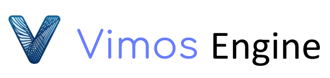
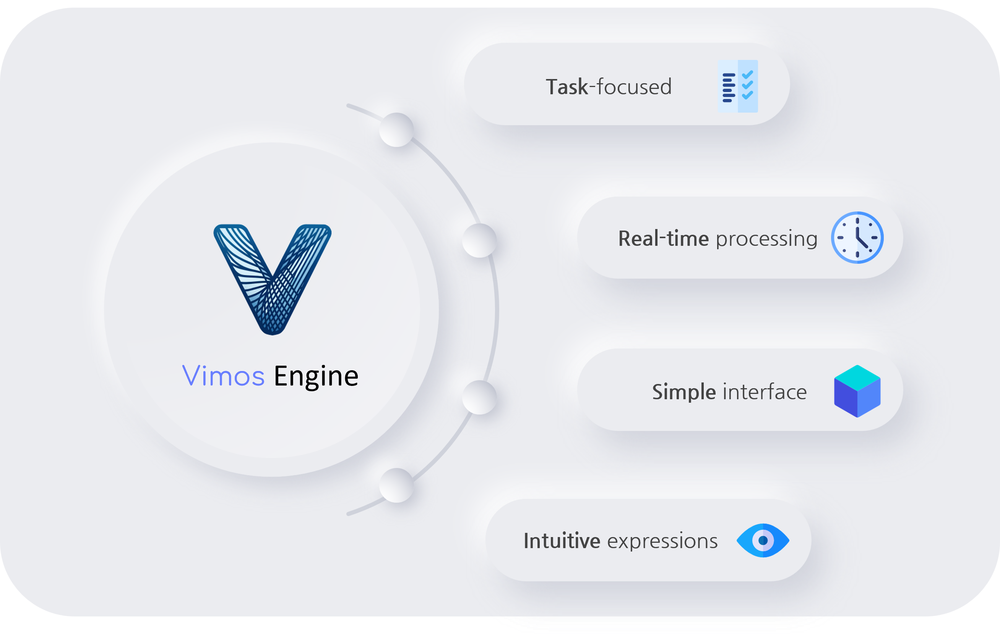
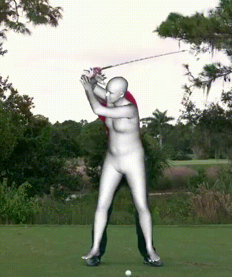
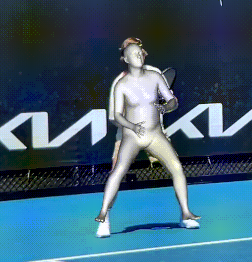
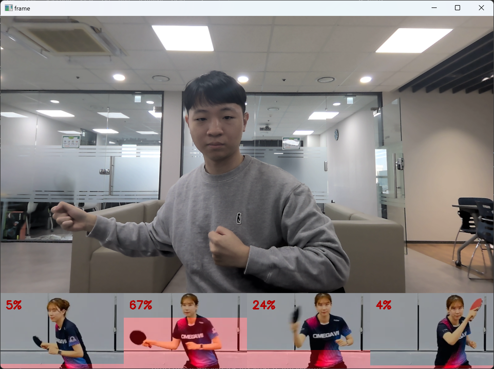
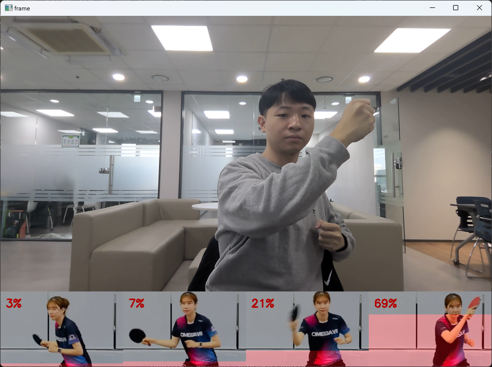
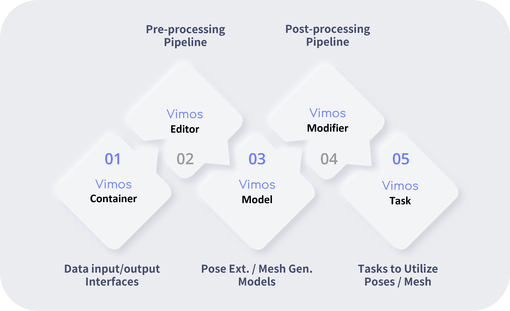
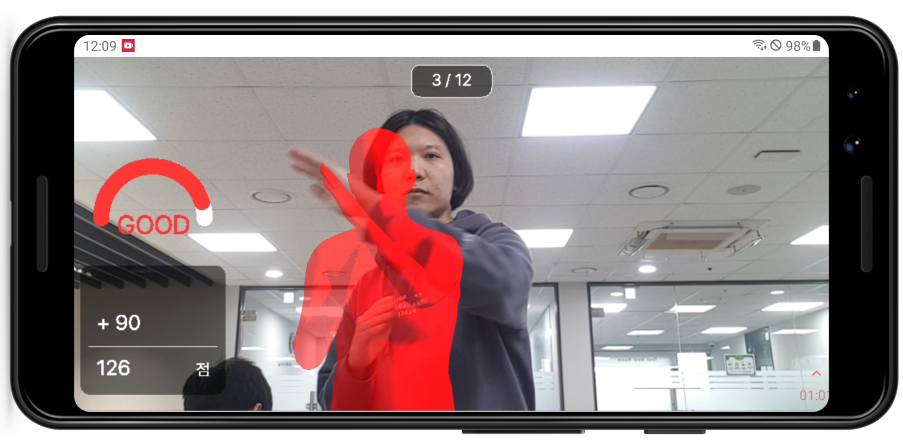

<h1 align="center">Vimos Engine</h1>

 

 <b>2023 SWM SeoulDynamics </b>

    

 <a href="https://seoul-dynamics.github.io/vimos/">API Docs</a>

  

# Contents

  <ol>
    <li><a href="#overview"> ◈ Overview</a></li>
    <li><a href="#getstarted"> ◈ Get started</a></li>
    <li><a href="#results"> ◈ Results </a></li>
    <li><a href="#features"> ◈ Features </a></li>
    <li><a href="#usages"> ◈ Usages </a></li>
  </ol>

  

<h1 id="overview"> Overview </h1>

> Vimos Engine is a solution that provides an API to easily use the pose estimation and 3D mocap technologies required for developing AI services.

 

### Motivation

Existing pose estimation frameworks were primarily developed for research purposes, making them complex and difficult to customize for production. The data was also provided in matrix form, requiring developers to manually index articulation points, and the logic for real-time processing had to be implemented by hand, which made it difficult to achieve user-friendliness and real-world production adoption.

### Purpose

    

Focusing on frequently utilized tasks beyond model implementation,
near real-time processing without a separate implementation, we planned the Vimos engine with the goal of eliminating complex interfaces and making it intuitive.

  

<h1 id="getstarted"> Get started </h1>

### Installation

You can easily install this solution by referring [install.md](docs/install.md).

  

<h1 id="results"> Results </h1>

### Pose Estimation Samples

    
    
    

### 3D Mocap Samples 

    
    

### Runtime Analysis

The Vimos engine uses multithreaded IO to minimize bottlenecks that can occur when loading a large number of files when using file I/O. In this case, loading 100,000 (192, 192) RGB images takes about 33% of the time compared to loading them sequentially, and the effect of multithreading is proportional to the number of images being loaded.

    

  

<h1 id="features"> Features </h1>

The Vimos engine is organized into five sub-modules. Each module functions sequentially to process data, describing the steps typically followed when implementing features that utilize pose estimatoin and 3D mocap.

    

|Module|Description|
|:---|:---|
|Container|Abstracts the data input/output interface to make it easier and simpler for users to fetch and store data.|
|Editor|Provides a scalable abstraction of the pipeline for preprocessing images for input to the model. |
|Model|It consists of two main parts: a Pose model for extracting postures and a Mesh model for extracting 3D human body meshes. Abstracts MMPose and FrankMocap to make them easier to use.|
|Modifier|Scalable abstraction of the pipeline that post-processes the output from the models, either a pose skeleton or a 3D mesh.|
|Task|Provide basic tasks that are redundantly used by multiple services in the form of classes so that users can use them without having to develop their own algorithms.|

For further details, check the [API Docs](https://seoul-dynamics.github.io/vimos/).

  

<h1 id="usages"> Usages </h1>

    

It's an example application that utilizes this engine: Ping Pong Coach. It is a service that helps users practice their posture based on 3D vision technology. As you practice different stances, such as forehand and backhand, the app gives you feedback by measuring the similarity of your pose based on your camera shot.
